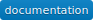

# Dataswim

[](https://travis-ci.org/synw/dataswim) [](https://coveralls.io/github/synw/dataswim?branch=master) [](https://dataswim.readthedocs.io/en/latest/index.html)

A simple api to explore, clean, transform and visualize data. This api is:

- **Minimalistic**: short names, simple functionalites, minimal parameters
- **Pragmatic**: focuses on raw efficiency rather than idiomatic code
- **Simple stupid**: keep it easy to understand for both code and api

## Features

- **Explore data**: describe, search and visualize raw data
- **Clean and transform data**: select, filter, normalize and reshape data
- **Visualize data**: many kind of charts and maps for geo data

## Install

Using conda:

   ```bash
   conda install pandas sqlalchemy seaborn arrow nltk scikit-learn
   conda install -c ioam holoviews bokeh
   conda install altair --channel conda-forge
   pip install --no-cache-dir dataset
   pip install pytablewriter goerr gencharts chartjspy stuf \
      deepdish folium influxdb
   
   pip install dataswim --no-deps
   ```

Using pip:

   ```bash
   pip install --no-cache-dir dataset
   pip install dataswim
   ```

To get the Altair charts in notebooks running install Vega:

   ```bash
   conda install -c conda-forge vega
   # or
   pip install vega
   ```

## Documentation

The [documentation](https://dataswim.readthedocs.io/en/latest/index.html) is available online

Some [Jupyter demo notebooks](https://github.com/synw/dataswim-notebooks) are available as example. 

To run the notebooks online click the 
badge: [](https://mybinder.org/v2/gh/synw/dataswim-notebooks/master)

## Dependencies

To compute data:

- [Pandas](https://github.com/pandas-dev/pandas)
- [Scikit-learn](http://scikit-learn.org)
- [Nltk](https://www.nltk.org/)

To chart data:

- [Bokeh](https://bokeh.pydata.org/en/latest/) with [Holoviews](http://holoviews.org/), 
- [Vega Lite](https://vega.github.io/vega-lite/) with [Altair](https://altair-viz.github.io/) 
- [Seaborn](http://seaborn.pydata.org)
- [Chartjs](http://www.chartjs.org/)
- [Folium](https://github.com/python-visualization/folium) for the maps

To handle databases:

- [Dataset](https://dataset.readthedocs.io/en/latest/) and [Sql Alchemy](http://www.sqlalchemy.org)

## Supported databases

- Postgresql
- Sqlite
- All those that Sql Alchemy supports

## Reporting

To generate static html reports use [dsreports](https://github.com/synw/dsreports)

To distribute reports with a http server use [django-chartflo](https://github.com/synw/django-chartflo)
